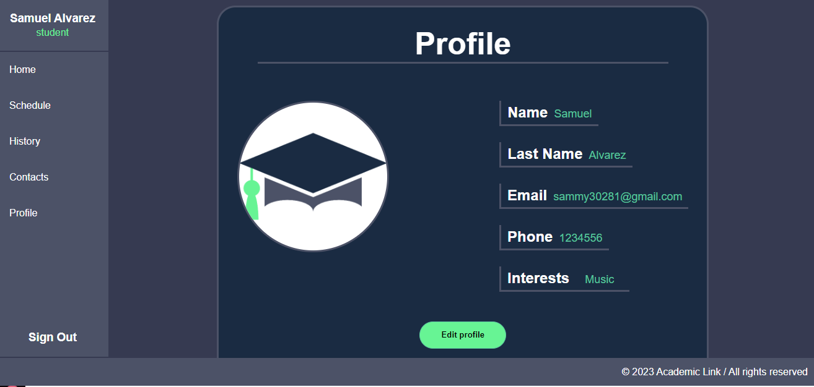
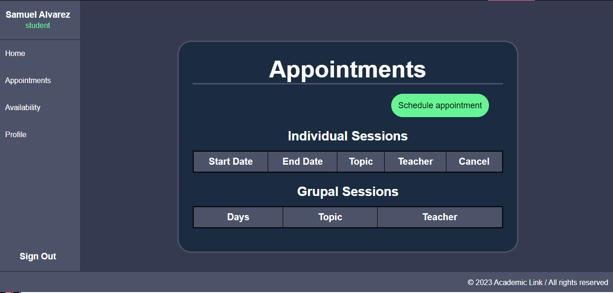

# academic-support-services.
Crear un sistema de agendamiento que maneje el crear, ver, modificar y borrar sobre las agendas de los estudiantes y profesores. 

# Tabla de contenidos
1. Ejemplos del proyecto
2. Objetivo del proyecto
3. Caracteristicas principales
4. Instalación y ejecución del proyecto
5. Construcción
6. Recursos útiles
7. Estado del proyecto
8. Acreditación de colaboradores
9. Autores
10. Contactanos


## EJEMPLOS DEL PROYECTO
[](https://github.com/geffrys/academic-support-services/blob/ce7743929ae2173b1008546fbd13a1503c531239/ejemplo%201.png)](https://github.com/geffrys/academic-support-services/blob/ce7743929ae2173b1008546fbd13a1503c531239/ejemplo%201.png)
](https://github.com/geffrys/academic-support-services/blob/ce7743929ae2173b1008546fbd13a1503c531239/ejemplo%202.png)

## OBJETIVO DEL PROYECTO
Este proyecto fue contruido con fines Educativos e institucionales, fue construido como parcial final de la materia Proyecto de construcción de software de la universidad Politecnico Jaime Izasa Cadavid

## CARACTERISTICAS PRINCIPALES
Es un sistema de agendamiento de una página que sirve para agendar asesorias, llamada Academic-support-services. 

## INSTALACIÓN Y EJECUCIÓN DEL PROYECTO
Antes de ejecutar el proyecto se deben seguir los siguientes pasos:
1. Descargar el proyecto de Github
2. Abrir Visual Studio Code, una vez ahí iniciar una terminal y poner los siguientes comandos:
   + `npm install`
3. Una vez instalado debes inciar una base de datos Mysql
4. En la base de datos debes poner el script que está en el archivo 'init.sql' y 'script.sql' que estan en la carpeta 'database'
5. Para iniciar el programa debes volver a la terminal de Visual Studio Code, moverte a la carpeta backend y poner: `npm run dev` y luego hacer lo mismo con la carpeta frontend, la terminal le avisará que puerto usa esta página, en este caso es el 3000, así que una vez iniciado el proyecto debes ir a: http://localhost:5173/
   - Si presenta fallas con la conección a la base de datos debes ir al archivo keys.js que se encuentra en la carpeta 'database', y verificar que en este fragmento de código:
     ```
     PORT= 3000
     USERDB= root
     PASSDB= admin
     DB_NAME= academic_link
     TOKEN_SECRET= "some_secret"
     SALT_ROUNDS= 10
   La información de `USERDB` este correcta, de igual manera la de `PASSDB`.

## CONSTRUCCIÓN

## RECURSOS ÚTILES
- [MERN Stack con MySQL - React MySQL CRUD (Context API, TailwindCSS)](https://www.youtube.com/watch?v=dJbd7BYofp4&t=1443s)
- [CRUD Sencillo en React JS (2020) ⚛️ | Insertar, Actualizar, Consultar, Eliminar. Tutorial en Español](https://www.youtube.com/watch?v=F4MdhfMn2vs&t=313s)


## ESTADO DEL PROYECTO
En desarrollo

## ACREDITACIÓN DE COLABORADORES

## AUTORES
- Samuel Alvarez Velasquez
- Samuel Ignacio Arango
- Geffry Alejandro Ospina
- Diego Alejandro Zapata García

## CONTACTANOS
- samuel_alvarez82201@elpoli.edu.co
- samuel_arango82211@elpoli.edu.co
- geffry_ospina84171@elpoli.edu.co
- diego_zapata82211@elpoli.edu.co
